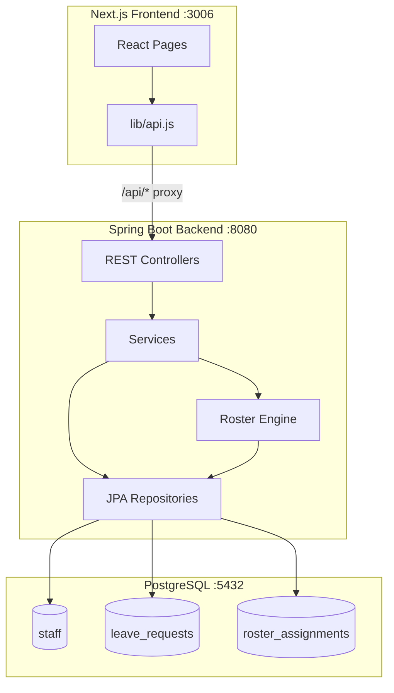

# Hospital Roster — System Architecture

## Tech Stack

| Layer | Technology | Version |
|-------|-----------|---------|
| **Frontend** | Next.js / React | 15 / 19 |
| **Backend** | Spring Boot / Java | 3.5.0 / 21 |
| **ORM** | Hibernate (Spring Data JPA) | 6.x |
| **Database** | PostgreSQL | 14.22 |
| **Build** | Maven (mvnw) | 3.x |
| **Package Mgr** | npm | 10.x |

---

## Architecture Diagram



---

## Project Structure

```
roaster/
├── specs/                    # This folder — documentation
├── backend/                  # Spring Boot application
│   ├── pom.xml
│   ├── mvnw / mvnw.cmd
│   └── src/main/java/com/roster/backend/
│       ├── BackendApplication.java       # Entry point
│       ├── config/
│       │   └── DataLoader.java           # Seeds 30 demo staff
│       ├── controller/
│       │   ├── StaffController.java      # /api/staff
│       │   ├── RosterController.java     # /api/roster
│       │   └── LeaveController.java      # /api/leaves
│       ├── dto/
│       │   ├── StaffRequest.java
│       │   ├── LeaveRequestDTO.java
│       │   ├── RosterGenerateRequest.java
│       │   └── RosterAssignmentResponse.java
│       ├── model/
│       │   ├── Staff.java                # JPA entity
│       │   ├── StaffRole.java            # Enum
│       │   ├── ShiftType.java            # Enum
│       │   ├── LeaveRequest.java         # JPA entity
│       │   └── RosterAssignment.java     # JPA entity
│       ├── repository/
│       │   ├── StaffRepository.java
│       │   ├── LeaveRequestRepository.java
│       │   └── RosterAssignmentRepository.java
│       └── service/
│           ├── StaffService.java
│           ├── LeaveService.java
│           ├── RosterEngineService.java  # Core scheduling logic
│           └── NotificationService.java
├── frontend/                 # Next.js application
│   ├── package.json
│   ├── next.config.mjs       # API proxy → :8080
│   ├── app/
│   │   ├── layout.js         # Root layout with Sidebar
│   │   ├── globals.css       # Dark navy glassmorphism design
│   │   ├── page.js           # Dashboard
│   │   ├── staff/page.js     # Staff Directory
│   │   └── leaves/page.js    # Leave Management
│   ├── components/
│   │   └── Sidebar.js        # Navigation sidebar
│   └── lib/
│       └── api.js            # API client (fetch wrappers)
├── .gitignore
└── README.md
```

---

## Key Design Decisions

| Decision | Rationale |
|----------|-----------|
| **Monorepo** (`backend/` + `frontend/`) | Simplifies development; single `git push` |
| **API proxy** (Next.js → Spring Boot) | Avoids CORS issues; frontend calls `/api/*` |
| **DataLoader** (not SQL scripts) | Bypasses CLI `psql` issues on corporate environments |
| **Hibernate `ddl-auto: update`** | Auto-creates tables; suitable for development |
| **Dark glassmorphism UI** | Modern, professional look matching Stitch MCP outputs |
| **Empty `settings.xml` override** | Bypasses corporate Maven mirror (`stla-repo`) |

---

## Running Locally

### Prerequisites
- Java 21+, Node.js 18+, PostgreSQL 14+

### Start Database
```bash
# PostgreSQL should be running on localhost:5432
# Database: hospital_roster, User: postgres, Password: postgres
```

### Start Backend
```bash
cd backend
./mvnw spring-boot:run -s /tmp/empty-settings.xml
# Runs on http://localhost:8080
```

### Start Frontend
```bash
cd frontend
npm install
npm run dev -- --port 3006
# Runs on http://localhost:3006
```
