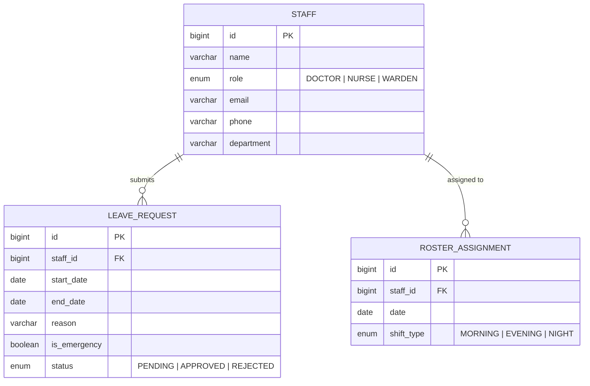

# Hospital Roster — Database Schema

**Database:** PostgreSQL 14+  
**ORM:** Hibernate (Spring Data JPA, `ddl-auto: update`)

---

## Entity Relationship Diagram



---

## Table: `staff`

| Column | Type | Constraints |
|--------|------|-------------|
| `id` | `BIGINT` | PK, auto-generated |
| `name` | `VARCHAR(255)` | NOT NULL |
| `role` | `VARCHAR(20)` | NOT NULL, enum: `DOCTOR`, `NURSE`, `WARDEN` |
| `email` | `VARCHAR(255)` | — |
| `phone` | `VARCHAR(50)` | — |
| `department` | `VARCHAR(100)` | — |

---

## Table: `leave_requests`

| Column | Type | Constraints |
|--------|------|-------------|
| `id` | `BIGINT` | PK, auto-generated |
| `staff_id` | `BIGINT` | FK → `staff.id`, NOT NULL |
| `start_date` | `DATE` | NOT NULL |
| `end_date` | `DATE` | NOT NULL |
| `reason` | `VARCHAR(500)` | — |
| `is_emergency` | `BOOLEAN` | default `false` |
| `status` | `VARCHAR(20)` | default `PENDING`, enum: `PENDING`, `APPROVED`, `REJECTED` |

---

## Table: `roster_assignments`

| Column | Type | Constraints |
|--------|------|-------------|
| `id` | `BIGINT` | PK, auto-generated |
| `staff_id` | `BIGINT` | FK → `staff.id`, NOT NULL |
| `date` | `DATE` | NOT NULL |
| `shift_type` | `VARCHAR(20)` | NOT NULL, enum: `MORNING`, `EVENING`, `NIGHT` |

**Unique constraint:** `(staff_id, date, shift_type)` — prevents double-assignment.

---

## Enums

### `StaffRole`
```java
public enum StaffRole {
    DOCTOR, NURSE, WARDEN
}
```

### `ShiftType`
```java
public enum ShiftType {
    MORNING, EVENING, NIGHT
}
```

---

## Seed Data

On first startup, `DataLoader.java` seeds **30 demo staff**:
- 5 Doctors (Cardiology, Neurology, Orthopedics, Pediatrics, General Medicine)
- 10 Nurses (Emergency, ICU, General Ward, Pediatrics, Surgical)
- 15 Wardens (Main Entrance, Ward A–F, ICU, Emergency, Night Patrol, Pharmacy, Lab, Cafeteria, Parking, Admin)
